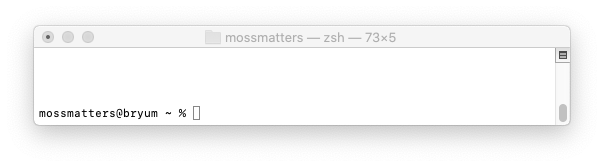

# Computing from the Command Line

For most of their history, the only way to interact with computers was to type commands into a terminal.
Today, most operating systems and applications use Graphical User Interfaces (GUIs) to present information and record input from a user.
However, many operations on a computer can still be conducted at the command line.

There are two primary reasons why getting comfortable using the command line is useful in bioinformatics.
First, the development of a GUI is difficult and many bioinformatics tools simply lack them.
Second, as you become more experienced, you will find it easier to write your own programs for achieving specific tasks, rather than relying on someone else's code.

The goal of this tutorial is to provide you with the basic tools for dealing with the command line in a UNIX-like environment. 

In this tutorial, commands you can type are represented by `block text`. Alternatively, Terminal commands and output may be represented like this:

``` 
Some block text
from your Terminal
```


## 1. Prerequisites 

To interact with your computer using a command-line interface, you will need to open a Terminal window. 
The best method will depend on your operating system:

### MacOSX
The MacOSX operating system is based on UNIX, so it comes pre-installed with a UNIX command line program called Terminal.
It is located within the Utilities folder, within the Applications folder on your computer.
Drag the Terminal app to your dock, then click to open.

### Windows

Windows, by contrast, is not a UNIX-based operating system, so you will need to install your own terminal. There are two general methods:

**Git-Bash**: a lightweight program to emulate a UNIX interface on Windows. Git-Bash is packaged with other tools and can be downloaded from [gitforwindows.org](gitforwindows.org) and install on your computer. There will be a number of choices during installation, and for basic beginner use the defaults are usually acceptable. When it has finished installing, launch the Git-Bash application.

**Ubuntu for Windows**: This method installs a fully-functional Linux operating system within Windows. [Follow the instructions in this link](https://ubuntu.com/tutorials/tutorial-ubuntu-on-windows#1-overview) to install Ubuntu for Windows from the Microsoft Windows Store. When Ubuntu has finished installing, 

Whichever program you open, you will be greeted by a window that looks something like this:



## 2. Finding your PATH

The image above contains a _command prompt_. 
In this example, the prompt has three pieces of information: a username (mossmatters), the computer's name (bryum), and the current directory, which is represented by a tilde (~). The prompt ends with a percent sign and commands are typed to the right. Other command prompts may be different and may end with other characters, like dollar signs.

When you first enter a command line terminal, it usually will place you in a location on your computer known as your *home directory*. The terminal uses the tilde (~) as a shortcut for the home directory, since most of your work will happen inside this directory.

Modern operating systems usually call directories "folders," but for this tutorial we will use the UNIX definition: a *directory* is a file that contains a list of file names within itself. All files on your computer are stored in a heirarchy of directories that is collectively known as the *file system*.

To figure out where you are in the file system, you need to know the *path* to your current location. This brings us to our very first command:

### `pwd`: Path to working directory

In your terminal window, type `pwd` and hit enter (or return). 
You will see something like this:

```
mossmatters@bryum ~ % pwd
/Users/mossmatters
```

Congratulations, you have entered your first command at the Terminal!
The command `pwd` will tell you where you are in your computer's file system.

In a UNIX-style file system, it will always begin at the *root directory*, which is representated by a forward slash /. 
All other directories are contained within the root directory.
In the example above:
- Inside the root directory is a directory called "Users"
- Inside the "Users" directory is a directory called "mossmatters"

`/Users/mossmatters` is therefore the *path* to our current location: the home directory for the user mossmatters.

A path that begins with the root directory, like the one above, is known as an *absolute path*. Think of it as a GPS location for items on your computer. No matter where you may end up on your computer system, you can always identify another location using the absolute path.


### `ls`: Listing the contents of a directory 

Now that we know where we are, the next command is to identify what's here. For that, use the `ls` command, and you will see something like this:

```
mossmatters@bryum ~ % ls
Desktop   Downloads Movies    Pictures
Documents Library   Music     Public
``` 

By listing the contents of the current directory, you can now identify other directories that you can move to. 

###  `cd`: Changing Directory

To move from one directory to another, you need to use the `cd` command, along with the name of a directory you want to move into. For example, to move into the Documents directory:

`cd Documents`

The terminal output may look something like this:

```
mossmatters@bryum ~ % ls
Desktop   Downloads Movies    Pictures
Documents Library   Music     Public
mossmatters@bryum ~ % cd Documents
mossmatters@bryum Documents %
```

Note that your command prompt changed to now include the new directory you are in.
Use `pwd` and `ls` to confirm that your directory has changed. What are the contents of this new directory?

If you received an error such as:

```
mossmatters@bryum ~ % cd Documents
cd: no such file or directory: Documents
mossmatters@bryum ~ %
```

Then it is possible that you did not have any Documents directory to move to. Is there a Documents directory listed when you use `ls`? If not, you can choose another directory to move into.

#### Relative PATH

There are a few universal shortcuts for directories on UNIX-style file systems. You've already encountered one, the tilde (~) for the home directory. Another shortcut is for going back one directory (towards the root directory), using two periods (..):

```
mossmatters@bryum ~ % pwd
/Users/mossmatters
mossmatters@bryum ~ % cd ..
mossmatters@bryum /Users % pwd
/Users
mossmatters@bryum /Users %
```

The use of `..` is a _relative path_, a location on the file system that is relative to your current position. 
If the absolute path is a GPS location, the relative path is more like "turn-by-turn" directions to get from one location to another.

Another shortcut is to use the `cd` command without any directory name. 
Doing this will always return you to your home directory.


### Chapter 2 Questions

1. What is the absolute path of your home directory?
2. How many files are listed when you use `ls` in your home directory?
3. Use `cd ..` until you are at the root directory. How many files are listed there?


## Chapter 3: Arguments 

In the final command of the previous chapter, you changed directories with `cd Documents`. This illustrates an important concept in command line interface: *arguments*. Each UNIX command (for example, `ls`, `pwd`, or `cd`) has a default behavior:

- `pwd` prints the current working directory
- `ls` lists the contents of the current directory
-  `cd` returns you to your home directory

If you want to use the command for anything else, you need to specify one or more *arguments*. These are usually separated from the main command using spaces. For example, in the command `cd Documents`, `cd` is the command, and `Documents` is the argument.

### Flags
Some arguments use a special identifier known as a flag to let the command know to use one or more options. Flags are usually specified with a dash followed by a single letter (`-a`) or two dashes follwed by a word (`--max`). 

For example, if you use the `-l` flag with `ls` you get a different output:

```
mossmatters@bryum ~ % ls -l
total 0
drwx------+  3 mossmatters  staff   96 Apr  5 17:15 Desktop
drwx------+  3 mossmatters  staff   96 Apr  5 17:15 Documents
drwx------+  3 mossmatters  staff   96 Apr  5 17:15 Downloads
drwx------+ 26 mossmatters  staff  832 Apr  5 17:15 Library
drwx------+  3 mossmatters  staff   96 Apr  5 17:15 Movies
drwx------+  3 mossmatters  staff   96 Apr  5 17:15 Music
drwx------+  3 mossmatters  staff   96 Apr  5 17:15 Pictures
drwxr-xr-x+  4 mossmatters  staff  128 Apr  5 17:15 Public
```
The `-l` flag for the `ls` command prints the contents in a long form, where you can see information about the contents, like the date it was modified and the file size.

To find out what flags are possible for a command, use the manual command `man`. If you type `man ls` and hit enter, a screen will appear telling you details about the ls command, including options. Use the arrow keys or spacebar to scroll through the document. When you are done viewing the document, press `q` to exit.

From the "manpage" of `ls` we see that there are a few other arguments:

- `ls -t` sorts the contents by how recently they were modified
- `ls -a` also shows hidden files (files that start with `.`)
- `ls -h` prints the sizes of files in a human-readable format (bytes and kilobytes)

You can also add all of these together:

```
mossmatters@bryum ~ % ls -lath
total 8
drwx------+ 26 mossmatters  staff   832B Apr  5 17:15 Library
drwxr-xr-x+ 11 mossmatters  staff   352B Apr  5 17:15 .
-rw-------   1 mossmatters  staff     3B Apr  5 17:15 .CFUserTextEncoding
drwx------+  3 mossmatters  staff    96B Apr  5 17:15 Desktop
drwx------+  3 mossmatters  staff    96B Apr  5 17:15 Documents
drwx------+  3 mossmatters  staff    96B Apr  5 17:15 Downloads
drwx------+  3 mossmatters  staff    96B Apr  5 17:15 Movies
drwx------+  3 mossmatters  staff    96B Apr  5 17:15 Music
drwx------+  3 mossmatters  staff    96B Apr  5 17:15 Pictures
drwxr-xr-x+  4 mossmatters  staff   128B Apr  5 17:15 Public
drwxr-xr-x   6 root         admin   192B Apr  5 17:15 ..
```

Finally, `ls` can take both flag arguments and non-flag arguments. If you wish to list the contents of another directory (one you are not currently in), it can be written as an argument (for example: `ls -lath /bin`

Other, UNIX programs may have different help systems. Sometimes, a program will return the help information by default if you do not enter any command line flags. Alternatively, you can sometimes get help with `program -h` or `program --help`.

### Chapter 3 Questions

1. What are the possible flags for the `pwd` command?
2. What is the oldest file located in your root directory?
3. What command would you use to list the contents one directory above your current directory, using a relative path?

## Chapter 4: Manipulating Files

Now that you know how to navigate the UNIX file system, it is time to start creating, moving, and removing files from the Terminal command line. Let's create our first directory:

### `mkdir` creating new directories

Enter the command `mkdir myfirstdirectory`.
This command will make a new directory within your current directory. 
You can check that it succeeded with `ls`, and use `cd myfirstdirectory` to enter your new directory.

**Note**: if you receive an error such as "Permission denied" then you may not be able to make new files in that location. Go to your home directory using `cd` and try again.

### `touch` creating blank files

Creating directories is fun, but to really do some work you will also need to create regular text files. First, navigate to your new directory `myfirstdirectory`.

Use `touch myfirstfile.txt` to create a regular file. If you use `ls -l` you will see that the file is empty (0 bytes).

Open your text file in your default text editor with `open myfirstfile.txt`. Add some text, save the file, and close your text editor.

### `mv` and `cp`: moving and copying files

Both `mv` and `cp` require two arguments: the source location, and the destination location. For example, to move `myfirstfile.txt` to your home directory:

`mv myfirstfile.txt ~/myfirstfile.txt`

Confirm that you have successfully moved the file using `ls` for both your home directory and `myfirstdirectory`.

If you would like to save a copy of the file in another location, use `cp`. Navigate to your home directory and run this:

`cp myfirstfile.txt myfirstdirectory/myfirstcopy.txt`

You should now have two copies of the file, one in each directory.

### `rm`: removing files

**BE VERY CAREFUL WITH `rm`: THERE IS NO UNDO!!!**

You can remove files with the rm command. To remove a file, simply list its name. You do
not have to be in a directory to delete files within it, simply specify where the file is.

`rm myfirstdirectory/myfirstcopy.txt`

If you need to remove a directory, you will have to use the `-r` flag:

`rm -r myfirstdirectory`

Note that removing a directory also removes all of its contents. There is no Trash/Recycle Bin for UNIX-- removing a file is permanent, so be careful!

### Exercises for Chapter 4

1. In your home directory, create a directory called "First"
2. Inside the "First" directory, create a directory called "Second"
3. Run this command: `touch ~/First/Second/myfile.txt`
4. Make a copy of 'myfile.txt` in your home directory.

## Chapter 5: Flow Control

So far, all of the commands you have run have been simple. 
If they produce any output, it is printed back onto the screen.
In many UNIX applications, you will want to save the output into a file instead.
This process in UNIX is known as _flow control_. 
Using special characters like `>` and `|` you will redirect output wherever you want: to another file, or to another program.

### `echo`: Writing output to the screen

The `echo` command does what it promises:

```
mossmatters@bryum ~ % echo "Botany is the best."

Botany is the best.
mossmatters@bryum ~ % 
```

Whatever is typed will be printed back to the screen. What if we wanted to save the output in a file, instead? We can redirect the output using `>`:

```
mossmatters@bryum ~ % echo "Botany is the best." > truths.txt
mossmatters@bryum ~ % echo "Animals are better than plants." > lies.txt
mossmatters@bryum ~ %
```

Notice how there is not any output to the screen. However, the text is now saved within a file.

### `cat`: displaying the contents of a file

`cat` is a simple command used to print the entire content of one or more files:

```
mossmatters@bryum ~ % cat truths.txt 
Botany is the best.
mossmatters@bryum ~ % cat lies.txt
Animals are better than plants.
mossmatters@bryum ~ % cat truths.txt lies.txt
Botany is the best.
Animals are better than plants.
```

### Appending with `>>`

The special character `>` introduced above will overwrite any files. 
If you want to add (append) to the file instead, use `>>`

`echo "Fungi are a type of plant." >> lies.txt`


### `wc` : File statistics 

To get a summary of the contents of a text file, use the word count command `wc`:

```
mossmatters@bryum ~ % wc lies.txt 
       2      11      59 lies.txt
mossmatters@bryum ~ %
```

Three statistics are listed: number of lines, number of words, and number of characters.
If you want to only get the number of lines, use the `-l` flag. You can also specify more than one file:

```
mossmatters@bryum ~ % wc -l lies.txt truths.txt 
       2 lies.txt
       1 truths.txt
       3 total
```


### Piping with `|`

The results of one command may be given as the input for another command using the special character pipe `|`. 
When many pipes are chained together, this is commonly referred to as a _pipeline_. 

For example, how can we count the number of files in the current directory?
Well, we could save the output of `ls` to a file, and then count the number of lines with `wc`:

```
mossmatters@bryum ~ % ls > files.txt
mossmatters@bryum ~ % cat files.txt
Desktop
Documents
Downloads
Library
Movies
Music
Pictures
Public
files.txt
lies.txt
truths.txt
mossmatters@bryum ~ % wc -l files.txt
      11 files.txt
mossmatters@bryum ~ % 
```

However, with `|` we can do both at once!

```
mossmatters@bryum ~ % ls | wc -l
      11
mossmatters@bryum ~ % 
```


### `grep` : Searching within files

`grep` stands for GNU Regular Expressions, which have a deep and powerful use in text files. For this tutorial we will focus on using `grep` to match text within a file. 

`grep` takes two arguments: the pattern to search for, and the file to search

```
mossmatters@bryum ~ % grep "Fungi" lies.txt 
Fungi are a type of plant.
```

Even though `lies.txt` contains more than one line, `grep` only returned the line that contains `Fungi`.


### Chapter 5 Questions

1. What other flags besides `-l` can be used with `wc`?
1. Add three more truths and two more lies to the appropriate files using `echo` and `>>`. Confirm that you have written to the files successfully using `cat`
2. How would you figure out how many lines in `lies.txt` contain "plant", using `wc`, `grep`, and `|`?


 


       
